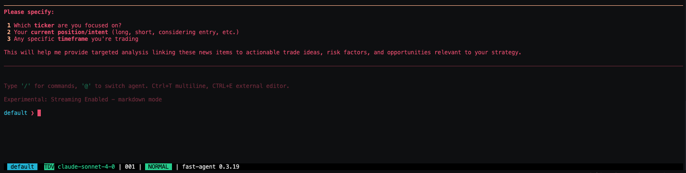

## News Analyzer Agent

Prototype aims to build a trading assistant that ingests real-time news data to guide traders in making informed decisions

**Core idea:** Given a stream of $n$ news items from a live pipeline, the agent will interpret this data, then leverage various `/tools`, `/skills`, and other commands, based on a provided `/ticker` and `/idea`
- The aim is to integrate these analytical tools as an MCP module using [`fast-agent`](https://fast-agent.ai/), enabling the agent to run fast, in-depth, and custom analyses through CLI-like tools.

## Setup

### 1. Create your `venv` and install the dependencies

Recommend using `uv` as your project/package manager

### 2. Add your credentials to `fastagent.secrets.yaml` and configure your model in `fastagent.config.yaml`

You have a variety of models to choose from
- **OpenAI (GPT-3, GPT-4, etc.)** via OpenAI's API
- **Anthropic (Claude models)**
- **Google (Gemini, PaLM via VertexAI API)**
- **Open-source LLMs** through compatible APIs or MCP servers (Llama, Mistral, etc.)
- **Other commercial APIs**: Cohere, Aleph Alpha, and more if they offer compatible endpoints
- **Custom/Local models** exposed by you or the community as MCP servers

Alternatively, you can use a `.env` file or any other secrets method and load credentials directly when instantiating `FastAgent()`. 
> Make sure to uncomment `fastagent.secrets.yaml` in `.gitignore` before committing.

### 3. Run the agent 

``` zsh
uv run agent.py
```

The decoy news can be found in `decoy_news.json`. It simulates three news sources for testing and ingestion exploration. You can modify or replace these to test new ingestion methods.

<div style="text-align: center;">

</div>

### Next Steps

* [ ] Build the MCP integration
* [ ] Expand the agent’s context window

  * **Potential enhancement:** import and embed news PDFs into a RAG DB pipeline

*"Given a company $X$ and upcoming trade idea, tell me what recent news may impact the trade, highlight risk & tail-events, and suggest key questions I should ask"*


